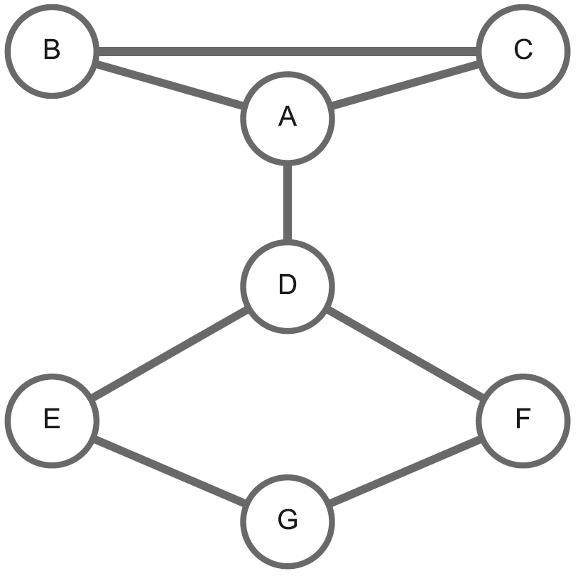

In this tutorial, I would walk you through basic operations on a graph constructed by unique UMIs observed at a single genomic locus.

## UMI and graph nodes

UMIs are imagined as nodes in a graph. There are two UMI graphs from UMI-tools[^1] and mclUMI[^2].

[^1]: Smith T, Heger A, Sudbery I. UMI-tools: modeling sequencing errors in Unique Molecular Identifiers to improve quantification accuracy. Genome Res. 2017 Mar;27(3):491-499. doi: 10.1101/gr.209601.116. Epub 2017 Jan 18. PMID: 28100584; PMCID: PMC5340976.

[^2]: Jianfeng Sun and Adam Cribss. mclUMI: Markov clustering of unique molecular identifiers allows removing PCR duplicates dynamically. https://github.com/2003100127/mclumi

:material-graph-outline: **UMI-tools** graph: 6 unique UMIs observed at a locus from raw reads. Its adjacent list:

:material-language-python: `Python`
``` py linenums="1"
graph_adj_umitools = {
    'A': ['B', 'C', 'D'],
    'B': ['A', 'C'],
    'C': ['A', 'B'],
    'D': ['A', 'E', 'F'],
    'E': ['D'],
    'F': ['D'],
}
```

:material-graph-outline: **mclUMI** graph: 7 unique UMIs observed at a locus from raw reads. Its adjacent list:

:material-language-python: `Python`
``` py linenums="1"
graph_adj_mclumi = {
    'A': ['B', 'C', 'D'],
    'B': ['A', 'C'],
    'C': ['A', 'B'],
    'D': ['A', 'E', 'F'],
    'E': ['D', 'G'],
    'F': ['D', 'G'],
    'G': ['E', 'F'],
}
```

For `graph_adj_mclumi`, the graph is visually represented this way.

<figure markdown="span">
  { width="260" }
  <figcaption><strong>Fig</strong> 1. A 7-node UMI graph</figcaption>
</figure>

## Build a UMI graph

:material-language-python: `Python`
``` py linenums="1"
import umiche as uc

adj = uc.graph.adjacency(
    graph_adj=graph_adj_mclumi,
)
print(adj.graph)
```

:material-console: `console`
``` shell
{'A': ['B', 'C', 'D'], 'B': ['A', 'C'], 'C': ['A', 'B'], 'D': ['A', 'E', 'F'], 'E': ['D', 'G'], 'F': ['D', 'G'], 'G': ['E', 'F']}
```

If you want to turn it to a graph with digital nodes.

:material-language-python: `Python`
``` py linenums="1"
print(adj.graph_mapped)
```

:material-console: `console`
``` shell
30/07/2024 12:02:10 logger: ===>the graph is being mapped
30/07/2024 12:02:10 logger: ======>key map: {'A': 0, 'B': 1, 'C': 2, 'D': 3, 'E': 4, 'F': 5, 'G': 6}
30/07/2024 12:02:10 logger: ======>the graph is a dict
30/07/2024 12:02:10 logger: ======>the mapped graph: {0: [1, 2, 3], 1: [0, 2], 2: [0, 1], 3: [0, 4, 5], 4: [3, 6], 5: [3, 6], 6: [4, 5]}
{0: [1, 2, 3], 1: [0, 2], 2: [0, 1], 3: [0, 4, 5], 4: [3, 6], 5: [3, 6], 6: [4, 5]}
```

Python `dictionary`, which is the same as the form of the graph adjacent list.

:material-language-python: `Python`
``` py linenums="1"
print(adj.dict())
```

:material-console: `console`
``` shell
{'A': ['B', 'C', 'D'], 'B': ['A', 'C'], 'C': ['A', 'B'], 'D': ['A', 'E', 'F'], 'E': ['D', 'G'], 'F': ['D', 'G'], 'G': ['E', 'F']}
```

Python `set`

:material-language-python: `Python`
``` py linenums="1"
print(adj.set())
```

:material-console: `console`
``` shell
{'A': {'B', 'C', 'D'}, 'B': {'A', 'C'}, 'C': {'A', 'B'}, 'D': {'A', 'E', 'F'}, 'E': {'G', 'D'}, 'F': {'G', 'D'}, 'G': {'E', 'F'}}
```


Python `list`

:material-language-python: `Python`
``` py linenums="1"
print(adj.list())
```

:material-console: `console`
``` shell
[['B', 'C', 'D'], ['A', 'C'], ['A', 'B'], ['A', 'E', 'F'], ['D', 'G'], ['D', 'G'], ['E', 'F']]
```


Python `numpy ndarray`: adjacency matrix

:material-language-python: `Python`
``` py linenums="1"
print(adj.list())
```

:material-console: `console`
``` shell
[[0. 1. 1. 1. 0. 0. 0.]
 [1. 0. 1. 0. 0. 0. 0.]
 [1. 1. 0. 0. 0. 0. 0.]
 [1. 0. 0. 0. 1. 1. 0.]
 [0. 0. 0. 1. 0. 0. 1.]
 [0. 0. 0. 1. 0. 0. 1.]
 [0. 0. 0. 0. 1. 1. 0.]]
```

Edge list: symmetrical matrix containing repeated edges

:material-language-python: `Python`
``` py linenums="1"
print(adj.to_edge_list())
```

:material-console: `console`
``` shell
[('A', 'B'), ('A', 'C'), ('A', 'D'), ('B', 'A'), ('B', 'C'), ('C', 'A'), ('C', 'B'), ('D', 'A'), ('D', 'E'), ('D', 'F'), ('E', 'D'), ('E', 'G'), ('F', 'D'), ('F', 'G'), ('G', 'E'), ('G', 'F')]
```


Edge list: triangular matrix extracted from symmetrical matrix. You need to set `rr` as `True`.

:material-language-python: `Python`
``` py linenums="1"
print(adj.to_edge_list(
    rr=True,
))
```

:material-console: `console`
``` shell
[('C', 'B'), ('C', 'A'), ('B', 'A'), ('G', 'E'), ('E', 'D'), ('G', 'F'), ('D', 'A'), ('F', 'D')]
```


## UMI edges

A graph can be represented by an edge list as illustrated above. We put the above edge list `to_edge_list(rr=False)` to `uc.graph.edge` and we will be able to operate on the edges.

:material-language-python: `Python`
``` py linenums="1"
import umiche as uc

eg = uc.graph.edge(
    graph_edge_list=adj.to_edge_list(rr=False),
)
print(eg.graph)
print(eg.nodes)
print(eg.key_mapped)
```

:material-console: `console`
``` shell
graph: [('A', 'B'), ('A', 'C'), ('A', 'D'), ('B', 'A'), ('B', 'C'), ('C', 'A'), ('C', 'B'), ('D', 'A'), ('D', 'E'), ('D', 'F'), ('E', 'D'), ('E', 'G'), ('F', 'D'), ('F', 'G'), ('G', 'E'), ('G', 'F')]
key_mapped: {'A': 0, 'B': 1, 'C': 2, 'D': 3, 'E': 4, 'F': 5, 'G': 6}
nodes: ['A', 'B', 'C', 'D', 'E', 'F', 'G']
```

If we want to get non-redundant edges in the edge list, we can do

:material-language-python: `Python`
``` py linenums="1"
print(eg.rvredanduncy)
```

:material-console: `console`
``` shell
[('G', 'E'), ('F', 'D'), ('E', 'D'), ('C', 'A'), ('B', 'A'), ('D', 'A'), ('G', 'F'), ('C', 'B')]
```

Then, we can still output the properties of the edge-based graph.

:material-language-python: `Python`
``` py linenums="1"
eg.graph = eg.rvredanduncy
print(eg.graph)
print(eg.key_mapped)
print(eg.rvredanduncy)
```

:material-console: `console`
``` shell
[('G', 'E'), ('F', 'D'), ('E', 'D'), ('C', 'A'), ('B', 'A'), ('D', 'A'), ('G', 'F'), ('C', 'B')]
{'A': 0, 'B': 1, 'C': 2, 'D': 3, 'E': 4, 'F': 5, 'G': 6}
[('G', 'E'), ('F', 'D'), ('E', 'D'), ('C', 'A'), ('B', 'A'), ('D', 'A'), ('G', 'F'), ('C', 'B')]
```

We can convert it back the adjacency list and a new graph with digits mapped from the original graph.

:material-language-python: `Python`
``` py linenums="1"
print(eg.to_adj_dict())
print(eg.graph_mapped)
```

:material-console: `console`
``` shell
adjacency list: {'A': ['C', 'B', 'D'], 'B': ['A', 'C'], 'C': ['A', 'B'], 'D': ['F', 'E', 'A'], 'E': ['G', 'D'], 'F': ['D', 'G'], 'G': ['E', 'F']}

graph_mapped: [(6, 4), (5, 3), (4, 3), (2, 0), (1, 0), (3, 0), (6, 5), (2, 1)]
```