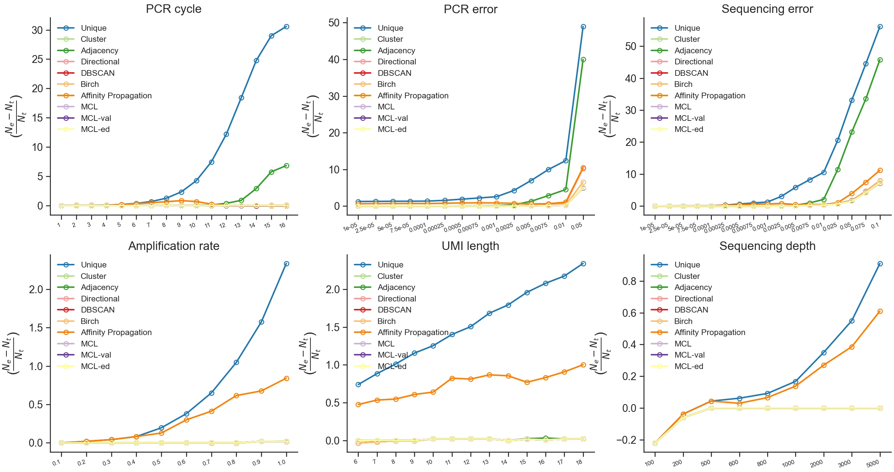

We build a function to handle and plot complex deduplication data with regard to different sequencing conditions and deduplication methods. The final results will be rendered on a multiple-panel lineplot.

:octicons-duplicate-16: Deduplication methods

We can first define deduplication methods.

``` py
methods={
    'unique': 'Unique',
    'cluster': 'Cluster',
    'adjacency': 'Adjacency',
    'directional': 'Directional',
    'dbscan_seq_onehot': 'DBSCAN',
    'birch_seq_onehot': 'Birch',
    'aprop_seq_onehot': 'Affinity Propagation',
    'mcl': 'MCL',
    'mcl_val': 'MCL-val',
    'mcl_ed': 'MCL-ed',
}
```

:octicons-sort-asc-16: Sequencing conditions

``` py
scenarios={
    'pcr_nums': 'PCR cycle',
    'pcr_errs': 'PCR error',
    'seq_errs': 'Sequencing error',
    'ampl_rates': 'Amplification rate',
    'umi_lens': 'UMI length',
    'seq_deps': 'Sequencing depth',
}
```

:material-language-python: `Python`
``` py linenums="1"
import umiche as uc

df = uc.plot.dedup_multiple(
    scenarios=scenarios,
    methods=methods,
    param_fpn=to('data/params.yml'),
)
print(plot_dm.line())
```

:material-console: `console`
``` shell
31/07/2024 00:20:57 logger: ======>key 1: work_dir
31/07/2024 00:20:57 logger: =========>value: D:/Document/Programming/Python/umiche/umiche/data/simu/mclumi/
31/07/2024 00:20:57 logger: ======>key 2: trimmed
31/07/2024 00:20:57 logger: =========>value: {'fastq': {'fpn': 'None', 'trimmed_fpn': 'None'}, 'umi_1': {'len': 10}, 'seq': {'len': 100}, 'read_struct': 'umi_1'}
31/07/2024 00:20:57 logger: ======>key 3: fixed
31/07/2024 00:20:57 logger: =========>value: {'pcr_num': 8, 'pcr_err': 1e-05, 'seq_err': 0.001, 'ampl_rate': 0.85, 'seq_dep': 400, 'umi_num': 50, 'permutation_num': 2, 'umi_unit_pattern': 1, 'umi_unit_len': 10, 'seq_sub_spl_rate': 0.333, 'sim_thres': 3}
31/07/2024 00:20:57 logger: ======>key 4: varied
31/07/2024 00:20:57 logger: =========>value: {'pcr_nums': [1, 2, 3, 4, 5, 6, 7, 8, 9, 10, 11, 12, 13, 14, 15, 16], 'pcr_errs': [1e-05, 2.5e-05, 5e-05, 7.5e-05, 0.0001, 0.00025, 0.0005, 0.00075, 0.001, 0.0025, 0.005, 0.0075, 0.01, 0.05], 'seq_errs': [1e-05, 2.5e-05, 5e-05, 7.5e-05, 0.0001, 0.00025, 0.0005, 0.00075, 0.001, 0.0025, 0.005, 0.0075, 0.01, 0.025, 0.05, 0.075, 0.1], 'ampl_rates': [0.1, 0.2, 0.3, 0.4, 0.5, 0.6, 0.7, 0.8, 0.9, 1.0], 'umi_lens': [6, 7, 8, 9, 10, 11, 12, 13, 14, 15, 16, 17, 18], 'umi_nums': [1, 2, 3, 4, 5, 6, 7, 8, 9, 10, 11, 12, 13, 14, 15, 16, 17, 18, 19, 20, 21, 22, 23, 24, 25, 26, 27, 28, 29, 30, 31, 32, 33, 34, 35, 36, 37, 38, 39, 40, 41, 42, 43, 44, 45], 'seq_deps': [100, 200, 500, 600, 800, 1000, 2000, 3000, 5000]}
31/07/2024 00:20:57 logger: ======>key 5: dedup
31/07/2024 00:20:57 logger: =========>value: {'dbscan_eps': 1.5, 'dbscan_min_spl': 1, 'birch_thres': 1.8, 'birch_n_clusters': 'None', 'hdbscan_min_spl': 3, 'aprop_preference': 'None', 'aprop_random_state': 0, 'ed_thres': 1, 'mcl_fold_thres': 1.6, 'iter_num': 100, 'inflat_val': [1.1, 2.7, 3.6], 'exp_val': 2}
31/07/2024 00:20:57 logger: ======>key 1: work_dir
31/07/2024 00:20:57 logger: =========>value: D:/Document/Programming/Python/umiche/umiche/data/simu/mclumi/
31/07/2024 00:20:57 logger: ======>key 2: trimmed
31/07/2024 00:20:57 logger: =========>value: {'fastq': {'fpn': 'None', 'trimmed_fpn': 'None'}, 'umi_1': {'len': 10}, 'seq': {'len': 100}, 'read_struct': 'umi_1'}
31/07/2024 00:20:57 logger: ======>key 3: fixed
31/07/2024 00:20:57 logger: =========>value: {'pcr_num': 8, 'pcr_err': 1e-05, 'seq_err': 0.001, 'ampl_rate': 0.85, 'seq_dep': 400, 'umi_num': 50, 'permutation_num': 2, 'umi_unit_pattern': 1, 'umi_unit_len': 10, 'seq_sub_spl_rate': 0.333, 'sim_thres': 3}
31/07/2024 00:20:57 logger: ======>key 4: varied
31/07/2024 00:20:57 logger: =========>value: {'pcr_nums': [1, 2, 3, 4, 5, 6, 7, 8, 9, 10, 11, 12, 13, 14, 15, 16], 'pcr_errs': [1e-05, 2.5e-05, 5e-05, 7.5e-05, 0.0001, 0.00025, 0.0005, 0.00075, 0.001, 0.0025, 0.005, 0.0075, 0.01, 0.05], 'seq_errs': [1e-05, 2.5e-05, 5e-05, 7.5e-05, 0.0001, 0.00025, 0.0005, 0.00075, 0.001, 0.0025, 0.005, 0.0075, 0.01, 0.025, 0.05, 0.075, 0.1], 'ampl_rates': [0.1, 0.2, 0.3, 0.4, 0.5, 0.6, 0.7, 0.8, 0.9, 1.0], 'umi_lens': [6, 7, 8, 9, 10, 11, 12, 13, 14, 15, 16, 17, 18], 'umi_nums': [1, 2, 3, 4, 5, 6, 7, 8, 9, 10, 11, 12, 13, 14, 15, 16, 17, 18, 19, 20, 21, 22, 23, 24, 25, 26, 27, 28, 29, 30, 31, 32, 33, 34, 35, 36, 37, 38, 39, 40, 41, 42, 43, 44, 45], 'seq_deps': [100, 200, 500, 600, 800, 1000, 2000, 3000, 5000]}
31/07/2024 00:20:57 logger: ======>key 5: dedup
31/07/2024 00:20:57 logger: =========>value: {'dbscan_eps': 1.5, 'dbscan_min_spl': 1, 'birch_thres': 1.8, 'birch_n_clusters': 'None', 'hdbscan_min_spl': 3, 'aprop_preference': 'None', 'aprop_random_state': 0, 'ed_thres': 1, 'mcl_fold_thres': 1.6, 'iter_num': 100, 'inflat_val': [1.1, 2.7, 3.6], 'exp_val': 2}

pn0   pn1   pn2   pn3  ...      max-mean          scenario  method  metric
0   0.00  0.00  0.00  0.00  ...  0.000000e+00         PCR cycle  Unique       1
1   0.02  0.02  0.02  0.02  ...  3.321743e-18         PCR cycle  Unique       2
2   0.04  0.04  0.04  0.04  ...  6.643485e-18         PCR cycle  Unique       3
3   0.06  0.06  0.06  0.06  ...  7.462728e-03         PCR cycle  Unique       4
4   0.20  0.18  0.20  0.20  ...  9.860566e-03         PCR cycle  Unique       5
..   ...   ...   ...   ...  ...           ...               ...     ...     ...
4   0.00  0.00  0.00  0.00  ...  0.000000e+00  Sequencing depth  MCL-ed     800
5   0.00  0.00  0.00  0.00  ...  0.000000e+00  Sequencing depth  MCL-ed    1000
6   0.00  0.00  0.00  0.00  ...  0.000000e+00  Sequencing depth  MCL-ed    2000
7   0.00  0.00  0.00  0.00  ...  0.000000e+00  Sequencing depth  MCL-ed    3000
8   0.00  0.00  0.00  0.00  ...  0.000000e+00  Sequencing depth  MCL-ed    5000

[790 rows x 19 columns]
```

<figure markdown="span">
  { width="750" align=left }
  <figcaption><strong>Fig</strong> 1. UMI deduplication with multiple methods under multiple conditions</figcaption>
</figure>