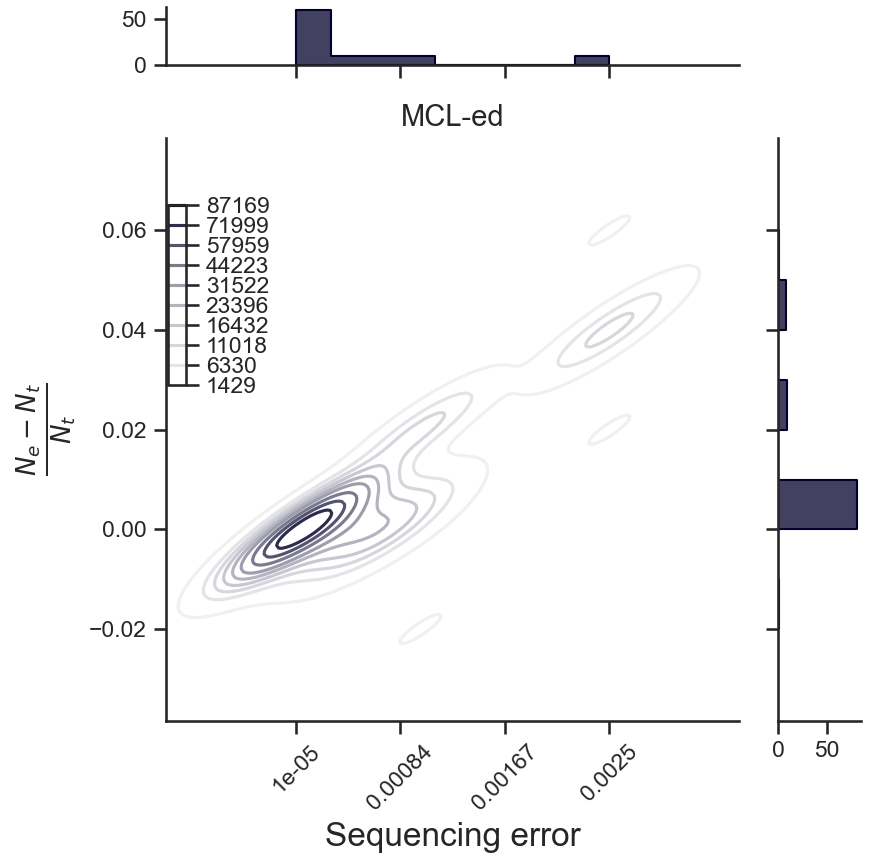
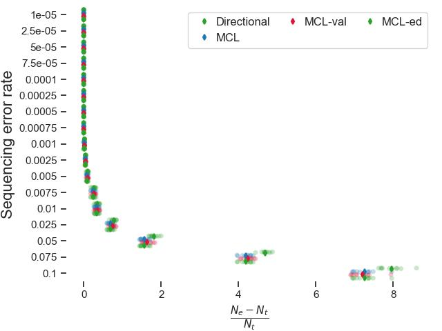
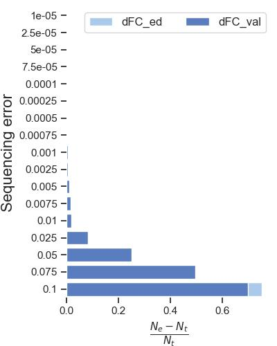

We can use UMIche to draw deduplication performance of Markov clustering versus its two important parameters, `inflation` and `expansion`. 

:octicons-sort-asc-16: Tabulate the statistics

:material-language-python: `Python`
``` py linenums="1"
from umiche.io import stat

scenarios = {
    # 'pcr_nums': 'PCR cycle',
    # 'pcr_errs': 'PCR error',
    'seq_errs': 'Sequencing error',
    # 'ampl_rates': 'Amplification rate',
    # 'umi_lens': 'UMI length',
    # 'seq_deps': 'Sequencing depth',
}
methods = {
    # 'unique': 'Unique',
    # 'cluster': 'Cluster',
    # 'adjacency': 'Adjacency',
    'directional': 'Directional',
    # 'dbscan_seq_onehot': 'DBSCAN',
    # 'birch_seq_onehot': 'Birch',
    # 'aprop_seq_onehot': 'Affinity Propagation',
    'mcl': 'MCL',
    'mcl_val': 'MCL-val',
    'mcl_ed': 'MCL-ed',
}
dedupstat = stat(
    scenarios=scenarios,
    methods=methods,
    param_fpn=to('data/params.yml'),
)

df_dedup = dedupstat.df_dedup
df_dedup_perm_melt = dedupstat.df_dedup_perm_melt
```

:octicons-sort-asc-16: Define `uc.plot.dedup_single` for better disease biology study.

:material-language-python: `Python`
``` py linenums="1"
import umiche as uc

t = uc.plot.dedup_single(
    df_dedup=df_dedup,
    df_dedup_perm_melt=df_dedup_perm_melt,
)
t.strip()
```

<figure markdown="span">
  { width="400" align=left }
  <figcaption><strong>Fig</strong> 1. Jointgrid plot.</figcaption>
</figure>


:material-language-python: `Python`
``` py linenums="1"
t.jointgrid()
```

<figure markdown="span">
  { width="400" align=left }
  <figcaption><strong>Fig</strong> 2. Strip plot.</figcaption>
</figure>

:material-language-python: `Python`
``` py linenums="1"
t.stackedbar()
```

<figure markdown="span">
  { width="400" align=left }
  <figcaption><strong>Fig</strong> 3. Stackedbar plot.</figcaption>
</figure>