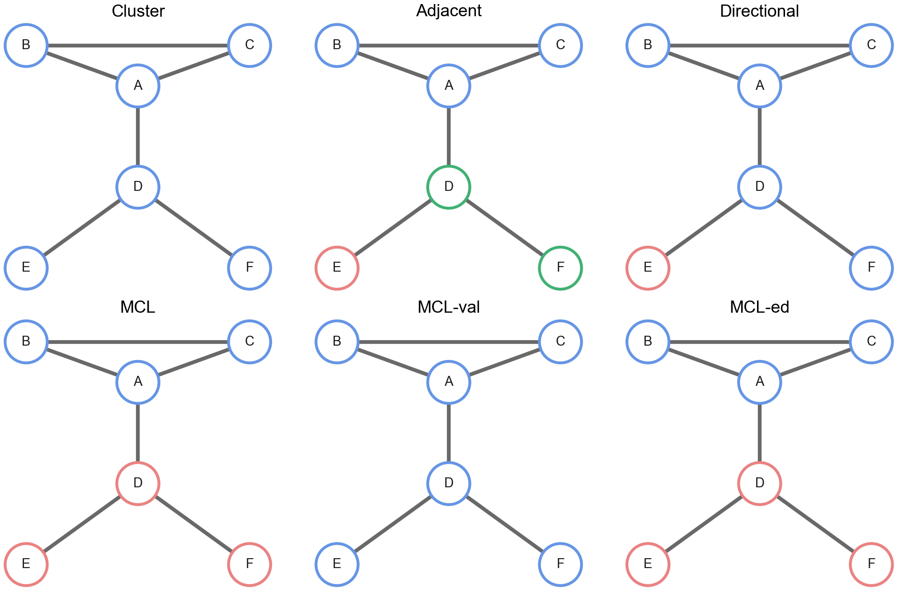

We understand UMI deduplication processes better in a visiable manner sometimes due to the complexity between a set of UMIs. Starting from building a 6-node UMI graph, we deduplicate UMIs and plot the final graph.

:material-step-forward: build a graph with data from UMI-tools

:material-language-python: `Python`
``` py linenums="1"
graph_adj = {
    'A': ['B', 'C', 'D'],
    'B': ['A', 'C'],
    'C': ['A', 'B'],
    'D': ['A', 'E', 'F'],
    'E': ['D'],
    'F': ['D'],
}
print("An adjacency list of a graph:\n{}".format(graph_adj))

node_val_sorted = pd.Series({
    'A': 456,
    'E': 90,
    'D': 72,
    'B': 2,
    'C': 2,
    'F': 1,
})
print("Counts sorted:\n{}".format(node_val_sorted))
```

:material-step-forward: deduplicate UMIs with 6 methods

:material-language-python: `Python`
``` py linenums="1"
### @@@ ******Connected components******
from umiche.deduplicate.method.Cluster import Cluster as umiclust
ccs = umiclust().cc(graph_adj=graph_adj)
print("Connected components:\n{}".format(ccs))

### @@@ ******UMI-tools Adjacency******
from umiche.deduplicate.method.Adjacency import Adjacency as umiadj
from umiche.deduplicate.method.Directional import Directional as umidirec
from umiche.deduplicate.method.MarkovClustering import MarkovClustering as umimcl
dedup_res_adj = umiadj().umi_tools(
    connected_components=ccs,
    df_umi_uniq_val_cnt=node_val_sorted,
    graph_adj=graph_adj,
)
dedup_res_adj_dc = umiadj().decompose(dedup_res_adj['clusters'])
print("deduplicated clusters (UMI-tools Adjacency):\n{}".format(dedup_res_adj_dc))

### @@@ ******UMI-tools Directional******
from umiche.deduplicate.method.Directional import Directional as umidirec
from umiche.deduplicate.method.MarkovClustering import MarkovClustering as umimcl
dedup_res_direc = umidirec().umi_tools(
    connected_components=ccs,
    df_umi_uniq_val_cnt=node_val_sorted,
    graph_adj=graph_adj,
)
dedup_res_direc_dc = umidirec().decompose(dedup_res_direc['clusters'])
print("deduplicated clusters (UMI-tools Directional):\n{}".format(dedup_res_direc_dc))

### @@@ ******MCL******
from umiche.deduplicate.method.MarkovClustering import MarkovClustering as umimcl
mcl = umimcl(
    inflat_val=1.6,
    exp_val=2,
    iter_num=100,
)
df_mcl = mcl.dfclusters(
    connected_components=ccs,
    graph_adj=graph_adj,
)
dedup_res_mcl_dc = mcl.decompose(list_nd=df_mcl['clusters'].values)
print("deduplicated clusters (MCL):\n{}".format(dedup_res_mcl_dc))

### @@@ ******MCL mcl_val******
df_mcl_val = mcl.maxval_val(
    df_mcl_ccs=df_mcl,
    df_umi_uniq_val_cnt=node_val_sorted,
    thres_fold=2,
)
dedup_res_mcl_val_dc = mcl.decompose(list_nd=df_mcl_val['clusters'].values)
print("deduplicated clusters decomposed (mcl_val):\n{}".format(dedup_res_mcl_val_dc))
dedup_res_mcl_val_dc_full = mcl.get_full_subcc(ccs_dict=dedup_res_mcl_val_dc, mcl_ccs_dict=dedup_res_mcl_dc)
print("deduplicated clusters decomposed full list(mcl_val):\n{}".format(dedup_res_mcl_val_dc_full))

### @@@ ******MCL mcl_ed******
int_to_umi_dict = {
    'A': 'ACGT',
    'B': 'TCGT',
    'C': 'CCGT',
    'D': 'ACAT',
    'E': 'ACAG',
    'F': 'AAAT',
}
df_mcl_ed = mcl.maxval_ed(
    df_mcl_ccs=df_mcl,
    df_umi_uniq_val_cnt=node_val_sorted,
    thres_fold=1,
    int_to_umi_dict=int_to_umi_dict,
)
dedup_res_mcl_ed_dc = mcl.decompose(list_nd=df_mcl_ed['clusters'].values)
print("deduplicated clusters decomposed (mcl_ed):\n{}".format(dedup_res_mcl_ed_dc))
dedup_res_mcl_ed_dc_full = mcl.get_full_subcc(ccs_dict=dedup_res_mcl_ed_dc, mcl_ccs_dict=dedup_res_mcl_dc)
print("deduplicated clusters decomposed full list(mcl_ed):\n{}".format(dedup_res_mcl_ed_dc_full))
```

:material-step-forward: draw UMI nodes with deduplicated information

:material-language-python: `Python`
``` py linenums="1"
fig, ax = plt.subplots(nrows=2, ncols=3, figsize=(14, 9.5))
p = Graph(graph=graph_adj)
p.color_list = ['cornflowerblue', 'lightcoral', 'mediumseagreen',]
p.draw(ccs, ax=ax[0, 0], title='Cluster')
p.draw(dedup_res_adj_dc, title='Adjacent', ax=ax[0, 1])
p.draw(dedup_res_direc_dc, title='Directional', ax=ax[0, 2])
p.draw(dedup_res_mcl_dc, title='MCL', ax=ax[1, 0])
p.draw(dedup_res_mcl_val_dc_full, title='MCL-val', ax=ax[1, 1])
p.draw(dedup_res_mcl_ed_dc_full, title='MCL-ed', ax=ax[1, 2])

plt.subplots_adjust(
    top=0.92,
    bottom=0.04,
    left=0.04,
    right=0.98,
    hspace=0.10,
    wspace=0.15,
)
plt.show()
```

<figure markdown="span">
  { width="600" align=left }
  <figcaption><strong>Fig</strong> 1. Graph-based identification of true molecules by collapsing UMIs using the cluster, adjacency, directional, mcl, mcl-ed, and mcl-val algorithms.</figcaption>
</figure>