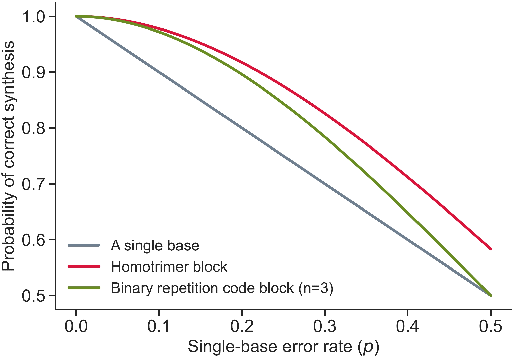
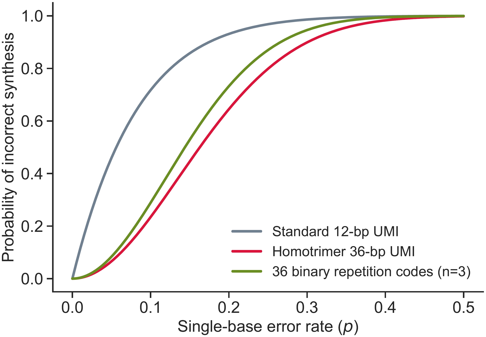

The `uc.plot.prob_correct` and `uc.plot.prob_incorrect` functions allows you to plot the probability of correct and incorrect synthesis of homotrimer building blocks and full sequences across varying error rates. Please see [this section](../tmranalysis.md#systematic_investigation_of_error_rate_changes) for details.

1. correct synthesis of a homotrimer building block (`num_nt=1`)

``` py
import numpy as np

error_rates= np.linspace(0.00001, 0.5, 500)

uc.plot.prob_correct(error_rate=error_rates, num_nt=1)
```

<figure markdown="span">
  { width="500" align=left }
</figure>
<figcaption><strong>Fig</strong> 1. Probability of correct synthesis for a single nucleotide, a binary repetition code block of 3 bits, and a homotrimer block as a function of a single-base error rate 𝑝.</figcaption>

2. incorrect synthesis of a whole sequence (`num_nt=12`)

``` py
uc.plot.prob_incorrect(error_rate=error_rates, num_nt=12)
```

<figure markdown="span">
  { width="500" align=left }
</figure>
<figcaption><strong>Fig</strong> 2. Probability of incorrect synthesis for a 12-bp standard UMI, a 36-bit binary (3, 1) repetition code, and a 36-bp homotrimer UMI.</figcaption>