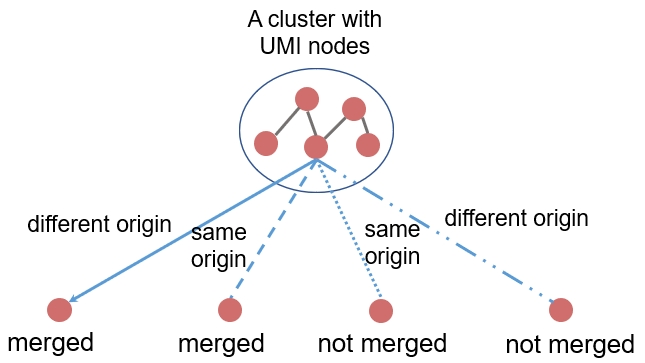
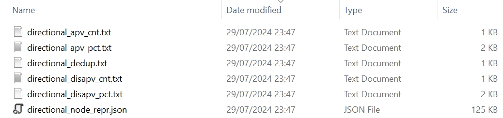

# 1. UMI trajectory

The `uc.pipeline.heterogeneity` function allows us to research trajectories of UMIs across PCR amplification cycles.

!!! example "Motivation"

    To merge UMI nodes, the UMI-tools' _Directional_ method launches a series of directed visits from a UMI node with the highest count to UMIs with a lower count. Ideally, when a node attempts to merge a neighbouring node into a cluster, reads attached with the two UMIs are derived from the same original molecule. 
    
    :material-key:**This can help understand if any two merged UMIs in a UMI graph (for deduplication) have the same origin**.

To gain an understanding of whether the directed visits in the directional method are beneficial to merge UMIs from the same origin, we labelled each amplified read the identifier of its original molecule to keep track of the source during the read simulation process. There are 4 possible situations, UMIs that are merged and derived from the same origin, UMIs that are merged but derived from a different origin, UMIs that are not merged but derived from the same origin, and UMIs that are not merged and derived from a different origin.

<figure markdown="span">
  { width="400" }
  <figcaption><strong>Fig</strong> 1. Schematic of merging UMIs into a cluster</figcaption>
</figure>

!!! tip

    Annotating UMIs with their origin is conducive to study their connectivity in a network in which a merge indicates an estimated association between two UMIs.

To generate the relationship between UMIs from any two adjacent PCR cycles, we can use the code below.

:material-language-python: Python
``` py linenums="1"
import umiche as uc

uc.pipeline.heterogeneity(
    # scenario='pcr_nums',
    # scenario='pcr_errs',
    scenario='seq_errs',
    # scenario='ampl_rates',
    # scenario='umi_lens',
    # scenario='seq_deps',
    # scenario='umi_nums',

    # method='unique',
    # method='cluster',
    # method='adjacency',
    method='directional',
    # method='mcl',
    # method='mcl_val',
    # method='mcl_ed',
    # method='mcl_cc_all_node_umis',
    # method='dbscan_seq_onehot',
    # method='birch_seq_onehot',
    # method='aprop_seq_onehot',
    # method='hdbscan_seq_onehot',
    # method='set_cover',

    is_trim=False,
    is_tobam=False,
    is_dedup=True,
    is_sv=True,

    param_fpn=to('data/params.yml'),
)
```

# 2. Spell-out

The UMIche's pipeline is designed to work on top of the output from Tresor. Thus, we might need to run the `heterogeneity` pipeline with raw FastQ reads. The UMI sequences are tagged with 3'/5' end of reads. The first thing we need to do is to extract UMI sequences and typically append them to the end of the name of each FastQ read. To do so, we need to set the following parameters and run the `uc.pipeline.heterogeneity` command.

``` py
is_trim=True,
is_tobam=False,
is_dedup=False,
```

Then, because the format of input to mclUMI is BAM, we need to convert the FastQ file to a BAM file. Please note that this is not to map reads to a genome but is simply a conversion from FastQ to BAM. To do so, we need to claim the following parameters and re-run the `uc.pipeline.heterogeneity` command.

``` py
is_trim=False,
is_tobam=True,
is_dedup=False,
```

Please notice that if you have mapped reads in BAM, you can omit this step.

Then, we re-run the `uc.pipeline.heterogeneity` command to mute `is_trim` and `is_dedup`, but open the deduplication channel with `is_dedup=True`. We can see the following output if we conduct the deduplication on simulated reads from two rounds of permutation tests. But if we set `verbose=True`, we will be prompted with more output in the console.

:material-note-multiple-outline: Output
``` shell
29/07/2024 23:47:04 logger: ======>key 1: work_dir
29/07/2024 23:47:04 logger: =========>value: /mnt/d/Document/Programming/Python/umiche/umiche/data/simu/mclumi/
29/07/2024 23:47:04 logger: ======>key 2: trimmed
29/07/2024 23:47:04 logger: =========>value: {'fastq': {'fpn': 'None', 'trimmed_fpn': 'None'}, 'umi_1': {'len': 10}, 'seq': {'len': 100}, 'read_struct': 'umi_1'}
29/07/2024 23:47:04 logger: ======>key 3: fixed
29/07/2024 23:47:04 logger: =========>value: {'pcr_num': 8, 'pcr_err': 1e-05, 'seq_err': 0.001, 'ampl_rate': 0.85, 'seq_dep': 400, 'umi_num': 50, 'permutation_num': 2, 'umi_unit_pattern': 1, 'umi_unit_len': 10, 'seq_sub_spl_rate': 0.333, 'sim_thres': 3}
29/07/2024 23:47:04 logger: ======>key 4: varied
29/07/2024 23:47:04 logger: =========>value: {'pcr_nums': [1, 2, 3, 4, 5, 6, 7, 8, 9, 10, 11, 12, 13, 14, 15, 16], 'pcr_errs': [1e-05, 2.5e-05, 5e-05, 7.5e-05, 0.0001, 0.00025, 0.0005, 0.00075, 0.001, 0.0025, 0.005, 0.0075, 0.01, 0.05], 'seq_errs': [1e-05, 2.5e-05, 5e-05, 7.5e-05, 0.0001, 0.00025, 0.0005, 0.00075, 0.001, 0.0025, 0.005, 0.0075, 0.01, 0.025, 0.05], 'ampl_rates': [0.1, 0.2, 0.3, 0.4, 0.5, 0.6, 0.7, 0.8, 0.9, 1.0], 'umi_lens': [6, 7, 8, 9, 10, 11, 12, 13, 14, 15, 16, 17, 18], 'umi_nums': [1, 2, 3, 4, 5, 6, 7, 8, 9, 10, 11, 12, 13, 14, 15, 16, 17, 18, 19, 20, 21, 22, 23, 24, 25, 26, 27, 28, 29, 30, 31, 32, 33, 34, 35, 36, 37, 38, 39, 40, 41, 42, 43, 44, 45], 'seq_deps': [100, 200, 500, 600, 800, 1000, 2000, 3000, 5000]}
29/07/2024 23:47:04 logger: ======>key 5: dedup
29/07/2024 23:47:04 logger: =========>value: {'dbscan_eps': 1.5, 'dbscan_min_spl': 1, 'birch_thres': 1.8, 'birch_n_clusters': 'None', 'hdbscan_min_spl': 3, 'aprop_preference': 'None', 'aprop_random_state': 0, 'ed_thres': 1, 'mcl_fold_thres': 1.6, 'iter_num': 100, 'inflat_val': 2.7, 'exp_val': 2}
===>dedup method: directional
===>No.0 permutation
No.0->1e-05 for seq_errs dedup cnt: 50
No.1->2.5e-05 for seq_errs dedup cnt: 50
No.2->5e-05 for seq_errs dedup cnt: 50
No.3->7.5e-05 for seq_errs dedup cnt: 50
No.4->0.0001 for seq_errs dedup cnt: 50
No.5->0.00025 for seq_errs dedup cnt: 50
No.6->0.0005 for seq_errs dedup cnt: 50
No.7->0.00075 for seq_errs dedup cnt: 50
No.8->0.001 for seq_errs dedup cnt: 51
No.9->0.0025 for seq_errs dedup cnt: 52
No.10->0.005 for seq_errs dedup cnt: 54
No.11->0.0075 for seq_errs dedup cnt: 63
No.12->0.01 for seq_errs dedup cnt: 70
No.13->0.025 for seq_errs dedup cnt: 89
No.14->0.05 for seq_errs dedup cnt: 150
    pn0
0    50
1    50
2    50
3    50
4    50
5    50
6    50
7    50
8    51
9    52
10   54
11   63
12   70
13   89
14  150
===>No.1 permutation
No.0->1e-05 for seq_errs dedup cnt: 50
No.1->2.5e-05 for seq_errs dedup cnt: 50
No.2->5e-05 for seq_errs dedup cnt: 50
No.3->7.5e-05 for seq_errs dedup cnt: 50
No.4->0.0001 for seq_errs dedup cnt: 50
No.5->0.00025 for seq_errs dedup cnt: 50
No.6->0.0005 for seq_errs dedup cnt: 50
No.7->0.00075 for seq_errs dedup cnt: 50
No.8->0.001 for seq_errs dedup cnt: 51
No.9->0.0025 for seq_errs dedup cnt: 53
No.10->0.005 for seq_errs dedup cnt: 53
No.11->0.0075 for seq_errs dedup cnt: 65
No.12->0.01 for seq_errs dedup cnt: 70
No.13->0.025 for seq_errs dedup cnt: 89
No.14->0.05 for seq_errs dedup cnt: 134
    pn0  pn1
0    50   50
1    50   50
2    50   50
3    50   50
4    50   50
5    50   50
6    50   50
7    50   50
8    51   51
9    52   53
10   54   53
11   63   65
12   70   70
13   89   89
14  150  134
```

# 3. Generated files

<figure markdown="span">
  { width="800" }
  <figcaption><strong>Fig</strong> 2. Generated files of the UMI trajectory</figcaption>
</figure>

:material-arrow-right-top: Homogeneity in origin between every two merged UMIs

=== ":material-file-document-multiple-outline:`directional_apv_cnt.txt`"

    ``` shell
    diff_origin	same_origin	total	scenario	method	permutation
    0	0	0	1	directional	0
    0	1	1	2	directional	0
    0	2	2	3	directional	0
    0	3	3	4	directional	0
    0	10	10	5	directional	0
    0	20	20	6	directional	0
    0	35	35	7	directional	0
    0	62	62	8	directional	0
    ...
    8	1244	1252	14	directional	9
    9	1438	1447	15	directional	9
    5	1528	1533	16	directional	9

    ```

=== ":material-file-document-multiple-outline:`directional_apv_pct.txt`"

    ``` shell
    diff_origin	same_origin	total	scenario	method	permutation
    0.0	0.0	1	1	directional	0
    0.0	0.02	1	2	directional	0
    0.0	0.04	1	3	directional	0
    0.0	0.06	1	4	directional	0
    0.0	0.18	1	5	directional	0
    0.0	0.36	1	6	directional	0
    0.0	0.5	1	7	directional	0
    0.0	0.6274509803921569	1	8	directional	0
    ...
    0.0031283774105759343	0.9968716225894241	1	14	directional	9
    0.002942775441849134	0.9970572245581508	1	15	directional	9
    0.001674603054245462	0.9983253969457546	1	16	directional	9

    ```

:material-arrow-right-top: Heterogeneity in origin between every two merged UMIs

=== ":material-file-document-multiple-outline:`directional_disapv_cnt.txt`"

    ``` shell
    diff_origin	same_origin	total	scenario	method	permutation
    0	0	0	1	directional	0
    0	0	0	2	directional	0
    0	0	0	3	directional	0
    0	0	0	4	directional	0
    0	0	0	5	directional	0
    0	0	0	6	directional	0
    0	0	0	7	directional	0
    0	0	0	8	directional	0
    ...
    5	519	524	14	directional	9
    15	875	890	15	directional	9
    19	1163	1182	16	directional	9

    ```

=== ":material-file-document-multiple-outline:`directional_disapv_pct.txt`"

    ``` shell
    diff_origin	same_origin	total	scenario	method	permutation
    0.0	0.0	1	1	directional	0
    0.0	0.0	1	2	directional	0
    0.0	0.0	1	3	directional	0
    0.0	0.0	1	4	directional	0
    0.0	0.0	1	5	directional	0
    0.0	0.0	1	6	directional	0
    0.0	0.0	1	7	directional	0
    0.0	0.0	1	8	directional	0
    ...
    0.003969508752117447	0.9960304912478826	1	14	directional	9
    0.006470058266103986	0.9935299417338961	1	15	directional	9
    0.005888901910230868	0.9941110980897692	1	16	directional	9
    ```