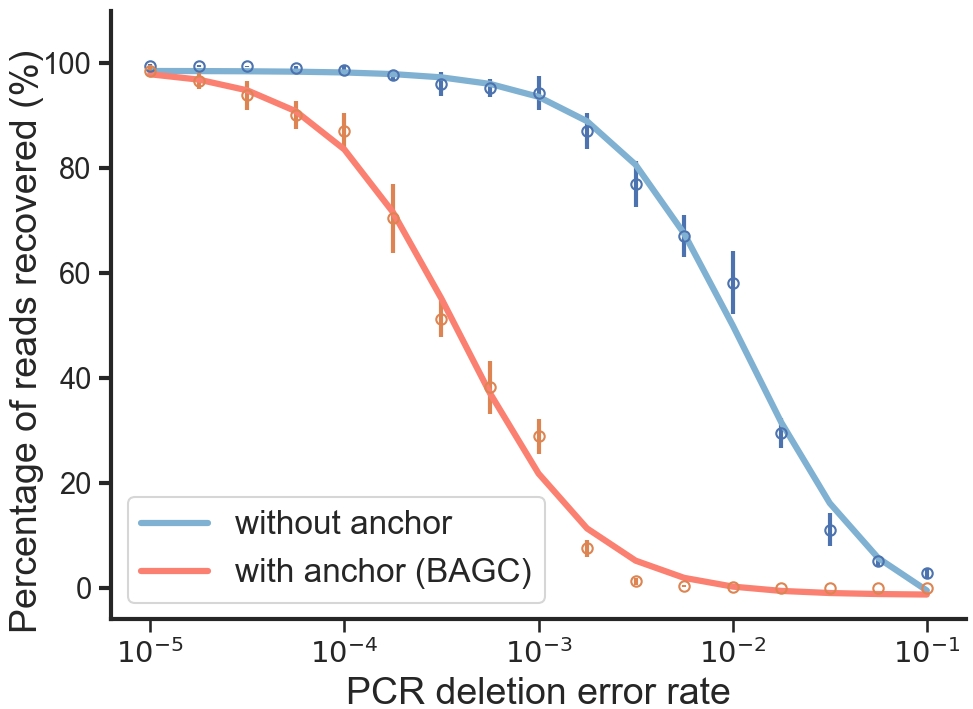
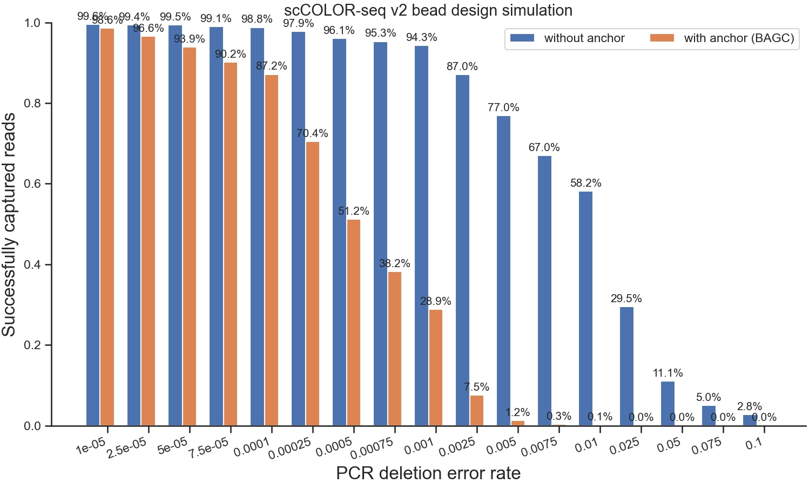

We use the following code to generate the plot. This function visualizes the anchor detection efficiency by plotting the percentage of total reads captured and the percentage of anchor-containing reads across different error rates. You can switch the condition argument to analyze other types of error scenarios.

We set four conditions: PCR deletion error rate, Sequencing deletion error rate, Sequencing insertion error rate, and PCR insertion error rate.

``` py
uc.vis.anchor_efficiency(
    criteria=criteria,
    quant_captured=pct_reads,
    quant_anchor_captured=pct_anchor_reads,
    condition='PCR deletion error rate',
)
```

<figure markdown="span">
  { width="500" align=center }
  <figcaption><strong>Fig</strong> 1. Percentage of captured reads with or without an anchor.</figcaption>
</figure>

In addition, we can use the following code to visualise it with bars.

``` py
uc.vis.anchor_efficiency_simple(
    criteria=criteria,
    quant_captured=pct_reads,
    quant_anchor_captured=pct_anchor_reads,
    condition='PCR deletion error rate',
    # condition='Sequencing deletion error rate',
    # condition='Sequencing insertion error rate',
    # condition='PCR insertion error rate',
)
```

<figure markdown="span">
  { width="500" align=center }
  <figcaption><strong>Fig</strong> 1. Percentage of captured reads with or without an anchor.</figcaption>
</figure>