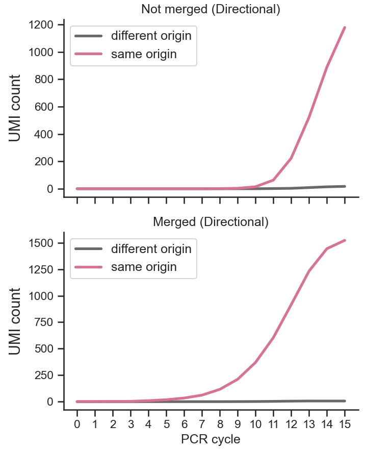
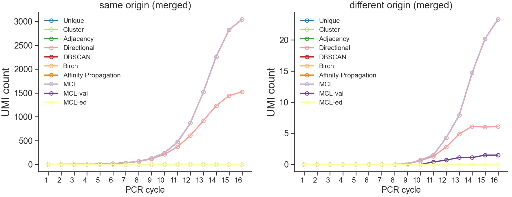

We recorded the information about UMI identities as soon as there is a merging operation. We can visualise them using methods alone or in bulk.

## :material-tools: One method alone

:material-step-forward: read the statistics

:material-language-python: `Python`
``` py linenums="1"
from umiche.deduplicate.io.Stat import Stat as dedupstat
scenarios = {
    'pcr_nums': 'PCR cycle',
    # 'pcr_errs': 'PCR error',
    # 'seq_errs': 'Sequencing error',
    # 'ampl_rates': 'Amplification rate',
    # 'umi_lens': 'UMI length',
    # 'seq_deps': 'Sequencing depth',
}
methods = {
    # 'unique': 'Unique',
    # 'cluster': 'Cluster',
    # 'adjacency': 'Adjacency',
    'directional': 'Directional',
    # 'dbscan_seq_onehot': 'DBSCAN',
    # 'birch_seq_onehot': 'Birch',
    # 'aprop_seq_onehot': 'Affinity Propagation',
    # 'mcl': 'MCL',
    # 'mcl_val': 'MCL-val',
    # 'mcl_ed': 'MCL-ed',
}
dedupstat11 = dedupstat(
    scenarios=scenarios,
    methods=methods,
    param_fpn=to('data/params.yml'),
)
```

:material-step-forward: draw the plot

:material-language-python: `Python`
``` py linenums="1"
import umiche as uc

uc.plot.trace_single(
    df_apv=dedupstat11.df_trace_cnt['apv'],
    df_disapv=dedupstat11.df_trace_cnt['disapv'],
).line_apv_disapv()
```

<figure markdown="span">
  { width="400" }
  <figcaption><strong>Fig</strong> 1. Counts of merged or not merged UMIs derived from the same or different origin using the Directional method.</figcaption>
</figure>


## :material-tools: Multiple methods and panels

:material-step-forward: read the statistics

:material-language-python: `Python`
``` py linenums="1"
from umiche.deduplicate.io.Stat import Stat as dedupstat
scenarios = {
    'pcr_nums': 'PCR cycle',
    # 'pcr_errs': 'PCR error',
    # 'seq_errs': 'Sequencing error',
    # 'ampl_rates': 'Amplification rate',
    # 'umi_lens': 'UMI length',
    # 'seq_deps': 'Sequencing depth',
}
methods = {
    'unique': 'Unique',
    'cluster': 'Cluster',
    'adjacency': 'Adjacency',
    'directional': 'Directional',
    'dbscan_seq_onehot': 'DBSCAN',
    'birch_seq_onehot': 'Birch',
    'aprop_seq_onehot': 'Affinity Propagation',
    'mcl': 'MCL',
    'mcl_val': 'MCL-val',
    'mcl_ed': 'MCL-ed',
}
dedupstat22 = dedupstat(
    scenarios=scenarios,
    methods=methods,
    param_fpn=to('data/params.yml'),
)
```

:material-step-forward: draw the plot

:material-language-python: `Python`
``` py linenums="1"
import umiche as uc

uc.plot.trace_multiple(
    df_apv=dedupstat22.df_trace_cnt['apv'],
    df_disapv=dedupstat22.df_trace_cnt['disapv'],
    scenarios=scenarios,
    methods=methods,
).line_apv()
```

<figure markdown="span">
  { width="750" }
  <figcaption><strong>Fig</strong> 1. Counts of UMIs derived from the same origin to be merged across multiple PCR cycles with different UMI collapsing methods.</figcaption>
</figure>