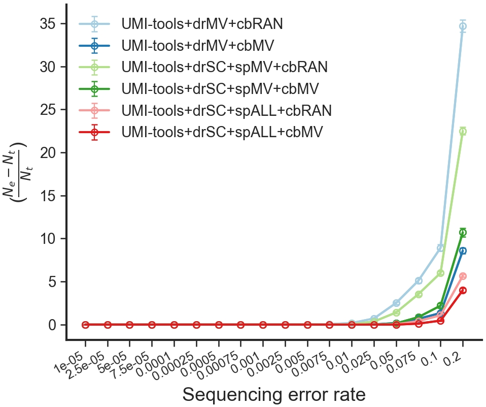

We generated a few files for deduplicating homotrimer UMIs. They are shown in the below code section.

``` py
methods={
    'directional_dedupby_majority_vote_splitby__collblockby_take_by_order': 'UMI-tools+drMV+cbRAN',
    'directional_dedupby_majority_vote_splitby__collblockby_majority_vote': 'UMI-tools+drMV+cbMV',
    'directional_dedupby_set_cover_splitby_split_by_mv_collblockby_take_by_order': 'UMI-tools+drSC+spMV+cbRAN',
    'directional_dedupby_set_cover_splitby_split_by_mv_collblockby_majority_vote': 'UMI-tools+drSC+spMV+cbMV',
    'directional_dedupby_set_cover_splitby_split_to_all_collblockby_take_by_order': 'UMI-tools+drSC+spALL+cbRAN',
    'directional_dedupby_set_cover_splitby_split_to_all_collblockby_majority_vote': 'UMI-tools+drSC+spALL+cbMV',
}
```

We can use `uc.plot.dedup_multiple_trimer` to directly draw a line plot for understanding their deduplication effects.

:material-language-python: `Python`
``` py linenums="1"
from umiche import uc

uc.plot.dedup_multiple_trimer(
    scenarios={
        'seq_errs': 'Sequencing error rate',
    },
    methods=methods,
    param_fpn=to('data/params_trimer.yml'),
).line()
```

<figure markdown="span">
  { width="500" }
  <figcaption><strong>Fig</strong> 1. Comparison of UMI-tools deduplication results between the majority vote and the set cover methods.</figcaption>
</figure>

