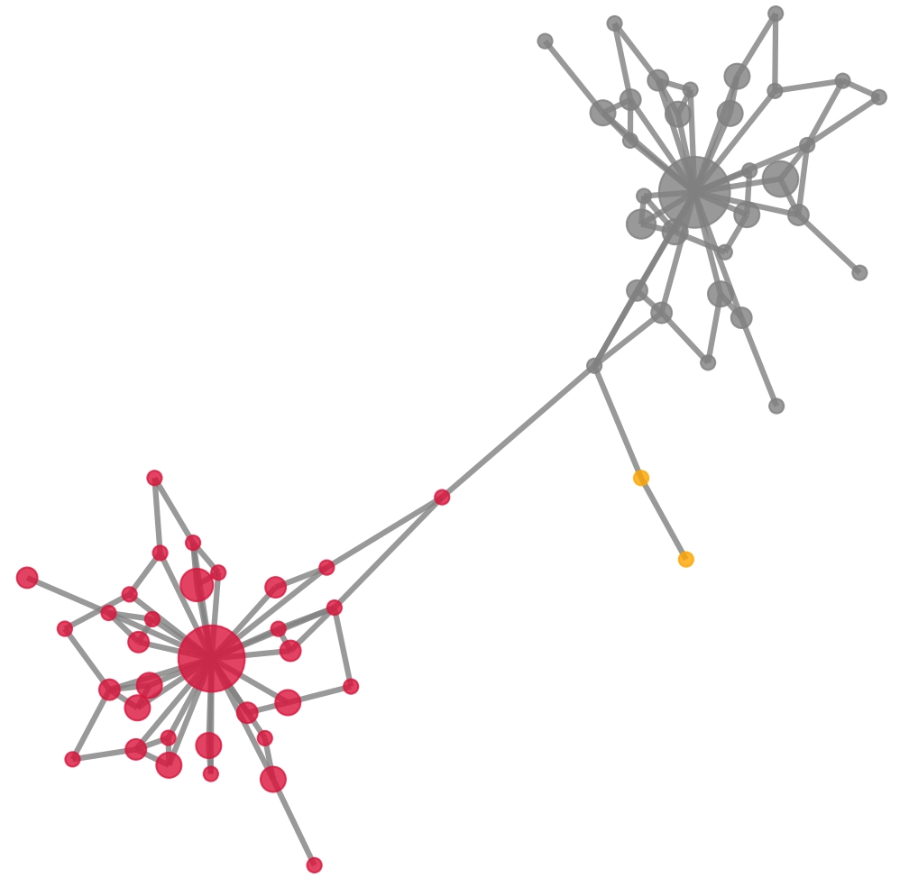

We extracted a UMI graph from simulated data observed at a single locus.

There are three Markov clusters.

``` text
dedup_cluster = [
[69, 72, 838, 1221, 97, 210, 249, 315, 324, 374, 457, 658, 727, 760, 771, 933, 1073, 1126, 1198, 1260, 1271, 1307, 1498, 1505, 1541, 1563, 914, 946, 1083, 684, 1288, 1543, 822],
[1174, 119, 290, 303, 204, 218, 289, 302, 404, 545, 586, 633, 674, 709, 720, 802, 884, 943, 980, 1355, 1436, 1488, 1553, 786, 537, 867, 1649, 1255, 701, 1080, 347, 251],
[1315, 1549]
],
```

The connected components are 

``` text
ccs = {69: [72, 838, 1221],
72: [69, 97, 210, 249, 315, 324, 374, 457, 658, 727, 760, 771, 838, 933, 1073, 1126, 1198, 1221, 1260,
1271, 1307, 1498, 1505, 1541, 1563], 838: [69, 72, 1221], 1221: [69, 72, 838, 914, 946],
97: [72, 658, 1505], 210: [72, 1083, 1271], 249: [72, 684, 727, 1073], 315: [72, 374, 946, 1126],
324: [72, 771], 374: [72, 315, 1126], 457: [72, 1288, 1307], 658: [72, 97, 1505], 727: [72, 249, 1073],
760: [72, 933, 1543], 771: [72, 324], 933: [72, 760], 1073: [72, 249, 727], 1126: [72, 315, 374],
1198: [72, 1260, 1541], 1260: [72, 1083, 1198, 1541, 1543], 1271: [72, 210], 1307: [72, 457],
1498: [72, 684, 1563], 1505: [72, 97, 658, 822], 1541: [72, 1198, 1260], 1563: [72, 914, 1498],
914: [1221, 1563], 946: [315, 1221], 1083: [210, 1260], 684: [249, 1498], 1288: [457],
1543: [760, 1174, 1260], 822: [1505], 1174: [119, 290, 303, 1315, 1543],
119: [204, 218, 289, 290, 302, 303, 404, 545, 586, 633, 674, 709, 720, 802, 884, 943, 980, 1174, 1355,
1436, 1488, 1553], 290: [119, 303, 786, 1174], 303: [119, 290, 1174], 1315: [1174, 1549],
204: [119, 537, 720, 1488], 218: [119, 302, 674, 867, 1649], 289: [119, 980],
302: [119, 218, 674, 1255], 404: [119, 802, 943], 545: [119, 701, 1436], 586: [119, 709, 884],
633: [119, 1080, 1553], 674: [119, 218, 302], 709: [119, 586, 884], 720: [119, 204, 347, 1488],
802: [119, 404, 537, 943], 884: [119, 586, 701, 709], 943: [119, 404, 802], 980: [119, 251, 289],
1355: [119, 251, 867], 1436: [119, 545], 1488: [119, 204, 720], 1553: [119, 633, 786], 786: [290, 1553],
1549: [1315], 537: [204, 802], 867: [218, 1355, 1649], 1649: [218, 867], 1255: [302], 701: [545, 884],
1080: [633], 347: [720], 251: [980, 1355]},
```

The edge list of the UMI graph is

``` text
edge_list=[(97, 72), (658, 97), (1355, 119), (204, 119), (1649, 218), (1541, 72), (933, 72), (914, 1563),
(1505, 72), (1221, 69), (404, 119), (1649, 867), (1307, 72), (302, 119), (802, 119), (1543, 760),
(1126, 72), (709, 586), (786, 1553), (374, 315), (946, 315), (1073, 72), (720, 204), (933, 760),
(1174, 1543), (210, 72), (771, 72), (537, 204), (727, 249), (1563, 72), (684, 1498), (822, 1505),
(1549, 1315), (1505, 97), (545, 119), (374, 72), (1553, 119), (1436, 119), (867, 218), (457, 72),
(1563, 1498), (709, 119), (720, 119), (1260, 1198), (1543, 1260), (218, 119), (251, 1355),
(701, 545), (1541, 1260), (1488, 204), (1553, 633), (1083, 210), (980, 289), (119, 1174),
(727, 72), (290, 119), (1073, 727), (1541, 1198), (884, 586), (802, 404), (303, 119), (347, 720),
(674, 218), (1221, 838), (1221, 72), (914, 1221), (943, 119), (586, 119), (943, 802), (838, 72),
(1271, 210), (980, 119), (674, 302), (786, 290), (251, 980), (1488, 720), (1488, 119),
(946, 1221), (1073, 249), (884, 709), (1288, 457), (1126, 315), (943, 404), (537, 802),
(302, 218), (249, 72), (315, 72), (303, 290), (290, 1174), (884, 119), (633, 119), (771, 324),
(658, 72), (1505, 658), (1307, 457), (303, 1174), (72, 69), (289, 119), (838, 69), (684, 249),
(1498, 72), (1315, 1174), (1126, 374), (701, 884), (1255, 302), (674, 119), (1080, 633),
(1083, 1260), (1436, 545), (1260, 72), (1271, 72), (867, 1355), (760, 72), (1198, 72), (324, 72)]
```

The unique UMIs have the counts stored in a `umi_uniq_val_cnt-simu.txt` file. UMI IDs are listed on the left while their counts are shown on the right.

``` text
27	122
119	23.8
15	118
13	115
16	112
126	109
32	106
72	20.8
80	104
7	104
14	103
47	103
10	101
58	100
...
```

``` py
import umiche as uc

uc.plot.graph_cluster(
    umi_uniq_val_cnt_fpn=to('data/simu/mclumi/seq_errs/umi_uniq_val_cnt-simu.txt'),
    dedup_cluster=dedup_cluster,
    ccs=ccs,
    edge_list=edge_list,
).draw()
```

<figure markdown="span">
  { width="500" align=left }
  <figcaption><strong>Fig</strong> 1. Graph representation of UMI clusters. Each node in the graphs represents a unique UMI. The node size is enlarged as the count of the unique UMIs increases. Different clusters are shown in different colours.</figcaption>
</figure>