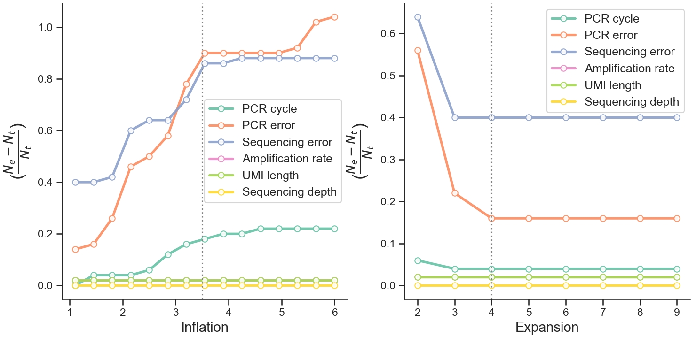

We can use UMIche to draw deduplication performance of Markov clustering versus its two important parameters, `inflation` and `expansion`. 

:material-language-python: `Python`
``` py linenums="1"
import umiche as uc

df = uc.plot.inflat_exp(
    scenarios={
        'pcr_nums': 'PCR cycle',
        'pcr_errs': 'PCR error',
        'seq_errs': 'Sequencing error',
        'ampl_rates': 'Amplification rate',
        'umi_lens': 'UMI length',
        'seq_deps': 'Sequencing depth',
    },
    methods={
        'mcl': 'MCL',
    },
    param_fpn=to('data/params.yml'),
).draw()
```

<figure markdown="span">
  { width="600" align=left }
  <figcaption><strong>Fig</strong> 1. Fold change between estimated and actual deduplicated counts with respect to the inflation (a) and expansion (b) parameters of the MCL algorithm.</figcaption>
</figure>