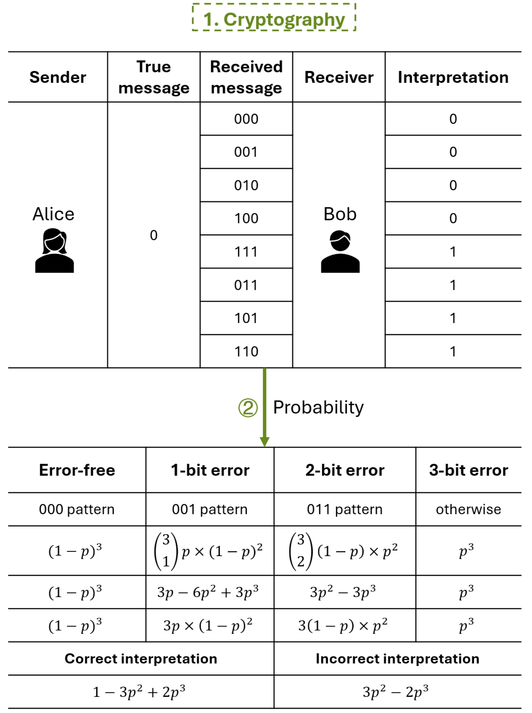
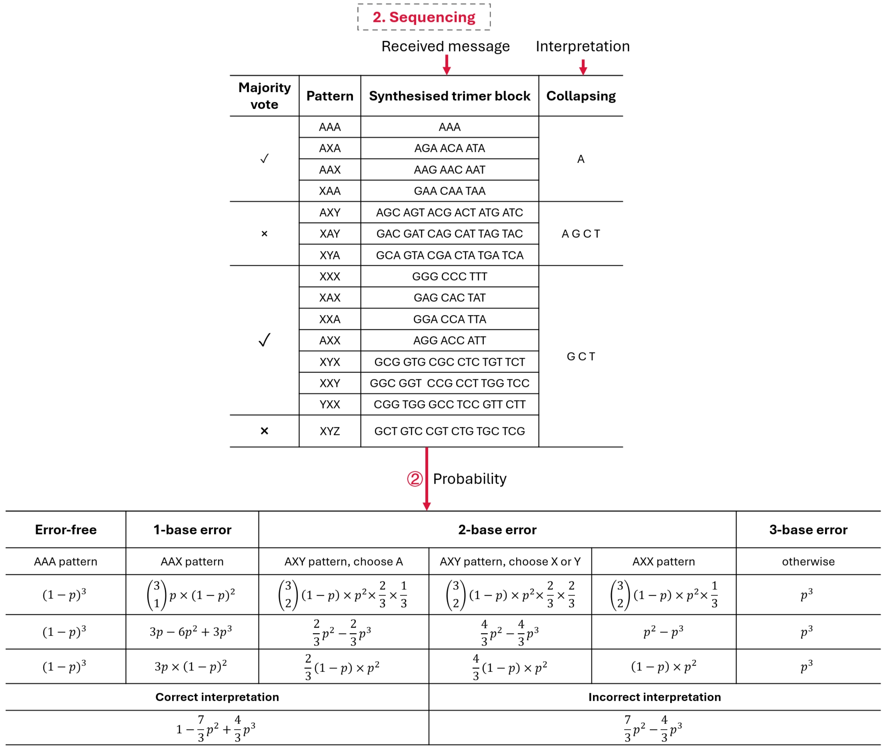
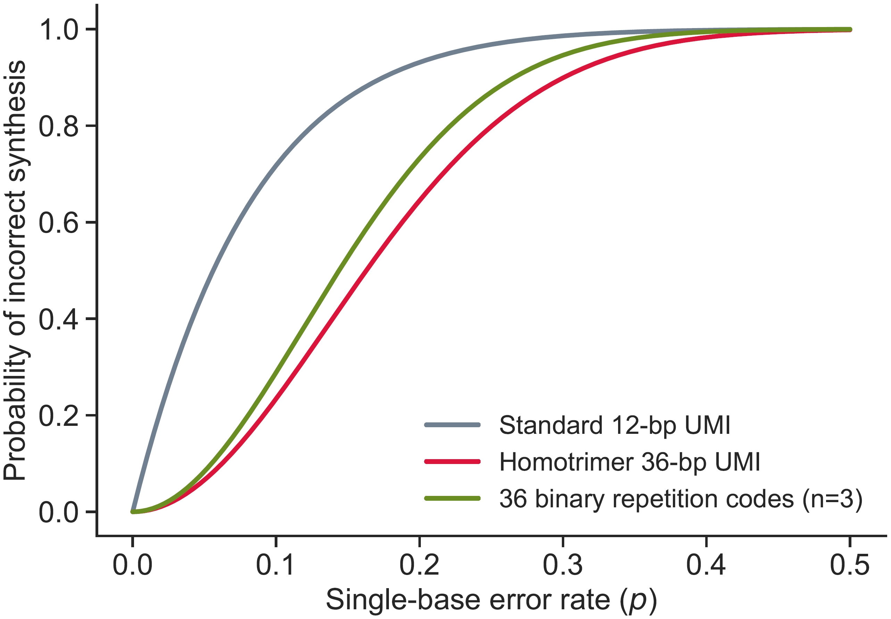

!!! quote "summary"

    "**Sequencing meets cryptography**: quadratic substitution error suppression through homotrimer redundancy"

The homotrimer unique molecular identifier (UMI), a simple yet powerful design in which each nucleotide is tripled (e.g., A → AAA), has demonstrated strong empirical performance in reducing sequencing errors[^1]. 

We provide a theoretical foundation for this approach by framing it through the lens of information theory and error-correcting codes, specifically [the triple modular redundancy (TMR)](https://en.wikipedia.org/wiki/Triple_modular_redundancy) and [the (3,1) repetition code](https://www.sciencedirect.com/topics/computer-science/repetition-code) used in cryptography. Unlike binary errors, nucleotide substitutions involve one of three alternative bases, introducing a unique probabilistic challenge. 

We derive an analytical model that accounts for both deterministic majority voting and stochastic tie-breaking, and show that the probability of decoding error scales quadratically with the per-base substitution rate. Compared to conventional UMIs and classical binary redundancy models, homotrimer UMIs provide high resilience under sequencing error conditions. The theoretical framework support the robustness of homotrimer redundancy and offer a new way for optimising UMI design, bridging principles from cryptography and molecular biology.


## Theoretical Derivation of Error Probabilities

### 1. TMR
We provide a conceptual analogy between repetition code error correction in cryptography and nucleotide-level error correction in sequencing using TMR.

<figure markdown="span">
  { width="500" align=left }
</figure>
<figcaption><strong>Fig</strong> 1. Overview of TMR applications in cryptography and sequencing.</figcaption>


### 2. Binary (3,1) Repetition Code

In digital communication, the canonical characters Alice and Bob are often used to represent the sender and receiver of a message. Suppose Alice wishes to transmit the bit 0. To protect against transmission errors, she applies TMR to encode 0 as 000, also known as the (3,1) repetition code. Due to potential noise in the channel, Bob may receive one of eight possible 3-bit combinations. As shown in Fig. 2, Bob applies majority voting to decode them into the original bit: if two or more of the received bits agree, that value is interpreted as the intended message. In this context, if a single bit is flipped regardless of its position, the voting mechanism can correctly recover the original message 0. Although half of the possible voting outcomes may lead to an erroneous result, the actual probability of incorrect interpretation remains low.

A classic (3,1) repetition code scheme is illustrated in a binary system, where Alice sends a bit 0 encoded as 000, and Bob decodes received messages using majority voting. A probability model quantifies the probability of correct or incorrect interpretation based on the number and pattern of bit flips.

<figure markdown="span">
  { width="500" align=left }
</figure>
<figcaption><strong>Fig</strong> 2. TMR in cryptography.</figcaption>

If each bit has an independent probability $p$ of flipping, then the probability $p_\text{rc_block}$ of a decoding error after applying majority voting is:

$$
P_\text{rc_block} = 3p^2(1 - p) + p^3 = 3p^2 - 2p^3
$$

---

### 3. Homotrimer Block Error Probability

We extend this logic to sequencing, where each base is encoded as a homotrimer (e.g., AAA). Unlike binary systems, DNA sequencing operates in a four-base system with substitution errors (e.g., A → C, G, or T). The majority-vote decoding is retained when possible, and collapsing is performed by random selection when no majority exists (e.g., ACG). A probability model is derived to quantify correct vs. incorrect block interpretation as a function of per-base error rate 𝑝, accounting for the combinatorics of 1, 2, and 3 substitution error scenarios.

<figure markdown="span">
  { width="700" align=left }
</figure>
<figcaption><strong>Fig</strong> 3. TMR in sequencing.</figcaption>

Therefore, the probability $p_\text{ht_block}$ of a mistakenly decoded nucleotide from a homotrimer block is:

$$
p_\text{ht_block} = \frac{7}{3}p^2(1-p) + p^3 = \frac{7}{3}p^2 - \frac{4}{3}p^3
$$

Here, $p$ represents the per-base substitution error rate.

---

### 3. Example: Substitution error rate of $10^{-5}$

Given $p = 0.00001$, the homotrimer block decoding error becomes:

$$
p_{\text{ht_block}} = \frac{7}{3}(0.00001)^2 - \frac{4}{3}(0.00001)^3
= \frac{7}{3} \cdot 10^{-10} - \frac{4}{3} \cdot 10^{-15}
= 2.3333 \times 10^{-10} - 1.3333 \times 10^{-15}
\approx 2.3333200000e-10
$$

This demonstrates the quadratic suppression of substitution errors enabled by homotrimer redundancy.

---

## Error rate calculation using UMIche

Let’s start with some preparation. We can use UMIche to calculate UMI error rates under various scenarios as follows. We initialize an error rate (**$p=0.00001$**) representing the probability of an error occurring at a single nucleotide.

``` py linenums="1"
import umiche as uc

ht_tmr = uc.homotrimer.tmr(error_rate=0.00001)
```

### 1. Block error rate 

We consider a building block to be erroneous if majority voting fails to correctly identify the original nucleotide. Based on this definition, we can calculate the probability of such an error.

``` py linenums="1"
ht_tmr.homotrimer_block_error
```

It outputs the following information.

``` shell
20/05/2025 23:53:43 logger: =========>homotrimer block error rate: 2.333320000000001e-10
2.333320000000001e-10
```

Comparably, we can get the possibility of the decoding error within a (3,1) repetition code block.

``` py linenums="1"
ht_tmr.bitflip_block_error
```

It outputs the following information.

``` shell
20/05/2025 23:56:07 logger: =========>binary repetition code block error rate is 2.9999800000000003e-10
2.9999800000000003e-10
```

### 2. UMI error rate 

We consider a UMI to be erroneous if any single building block is decoded incorrectly, without relying on external computational methods or tools for error correction. Based on this assumption, we can calculate the overall probability of UMI failure.

``` py linenums="1"
ht_tmr.homotrimer_umi_error
```

It outputs the following information.

``` shell
21/05/2025 00:05:29 logger: ======>homotrimer UMI error rate:
21/05/2025 00:05:29 logger: =========>homotrimer block error rate: 2.333320000000001e-10
21/05/2025 00:05:29 logger: =========>number of building blocks in a UMI is 12
2.799984244461484e-09
```

For the classical model, we can also calculate an error rate.

``` py linenums="1"
ht_tmr.bitflip_code_error
```

It outputs the following information.

``` shell
21/05/2025 00:05:29 logger: ======>binary repetition code error rate:
21/05/2025 00:05:29 logger: =========>binary repetition code block error rate is 2.9999800000000003e-10
21/05/2025 00:05:29 logger: =========>number of building blocks in a UMI is 12
3.5999763170480037e-09
```

In contrast, the traditional UMI exhibits a much higher error rate, which can be calculated as follows.

``` py linenums="1"
ht_tmr.homotrimer_umi_error
```

It outputs the following information.

``` shell
21/05/2025 00:09:10 logger: ======>monomer UMI error rate:
21/05/2025 00:09:10 logger: =========>number of building blocks in a UMI is 12
0.00011999340021939808
```


## Systematic investigation of error rate changes

### 1. Probability of correct synthesis per block

To see how different UMI designs handle sequencing errors, we looked at how the probability of correct synthesis changes with the single-base error rate 𝑝. We compared three setups: a single base without any redundancy, a classic binary repetition code where each bit is repeated three times and decoded by majority voting, and our homotrimer design, where each nucleotide is repeated three times and decoded in a similar way.

We used our tool, UMIche, to model these scenarios and generate the following plot. The grey line shows what happens with a single base—accuracy drops quickly as the error rate increases. The green line represents the binary repetition code, which does a better job but still struggles at higher error rates. The red line is the homotrimer block, and as you can see, it consistently performs the best across all values of 𝑝.

This means the homotrimer approach is more robust to substitution errors, especially in noisy environments, and that makes it a strong choice for improving sequencing accuracy.

``` py linenums="1"
import numpy as np

error_rates= np.linspace(0.00001, 0.5, 500)

uc.plot.prob_correct(error_rate=error_rates, num_nt=1)
```

<figure markdown="span">
  { width="500" align=left }
</figure>
<figcaption><strong>Fig</strong> 4. Probability of correct synthesis for a single nucleotide, a binary repetition code block of 3 bits, and a homotrimer block as a function of a single-base error rate 𝑝.</figcaption>

### 2. Probability of incorrect synthesis per UMI

Then we took it a step further and looked at the UMI level. We compared three full-length UMI designs: the standard 12-base UMI with no redundancy, a 36-base binary repetition code, and our 36-base homotrimer UMI. Just like at the block level, the homotrimer UMI came out on top: it had the lowest chance of decoding errors across all error rates. So this tells us that homotrimers aren't just theoretically better: they actually hold up really well in real-world conditions where substitution errors are common.


``` py linenums="1"
uc.plot.prob_incorrect(error_rate=error_rates, num_nt=12)
```

<figure markdown="span">
  { width="500" align=left }
</figure>
<figcaption><strong>Fig</strong> 5. Probability of incorrect synthesis for a 12-bp standard UMI, a 36-bit binary (3, 1) repetition code, and a 36-bp homotrimer UMI.</figcaption>


## Visual Summary

- Homotrimer encoding reduces sequencing errors compared to monomer UMIs and classical binary repetition codes.
- Majority voting or stochastic tie-breaking in homotrimers provides enhanced robustness to substitution errors.

[^1]: Sun, J., Philpott, M., Loi, D. et al. Correcting PCR amplification errors in unique molecular identifiers to generate accurate numbers of sequencing molecules. Nat Methods 21, 401–405 (2024). https://doi.org/10.1038/s41592-024-02168-y

